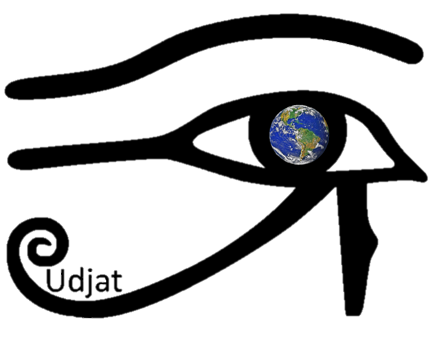
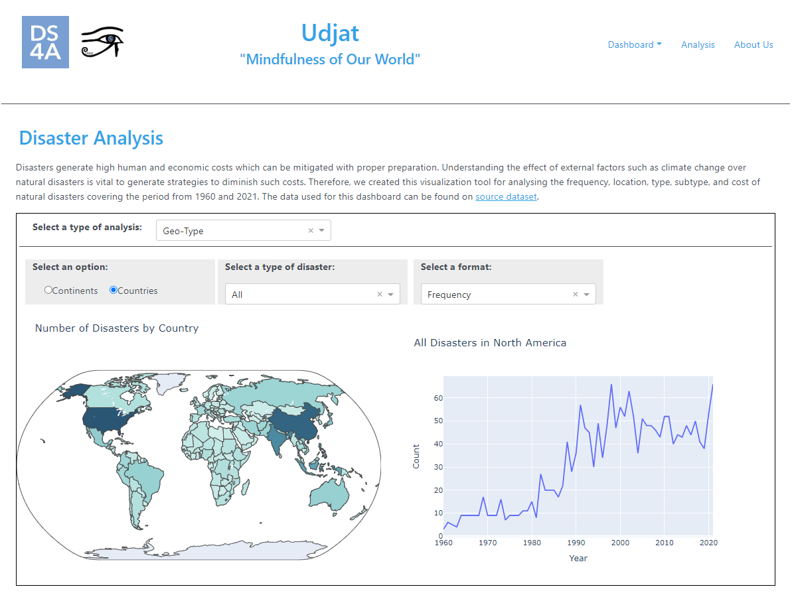
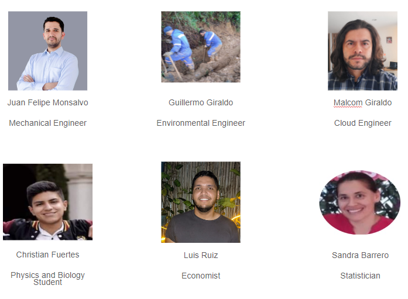

# DS4A Colombia 2022
## Udjat Project Team 40
### Natural Disaster Projection due to Climate Change Effects.

Climate change is a reality. It affects us all, and it will be more impactful in the coming years. One of the factors 
that will increase are natural disasters related to climate change. These disasters generate
high human and economic costs which can be mitigated with proper preparation. Understanding
the effect of external factors such as climate change over natural disasters  is vital to
generate strategies to diminish such costs. Visualizing the frequency and location of 
natural disasters and their possible correlation with climate change will allow the world 
to prepare for future events.

### Udjat WebApp

A common amulet, Udjat - the Eye of Horus - is a protective symbol against danger. We chose this symbol as a manner
to represent an all seeing, protective eye looking out for natural disasters. This is what we want for our WebApp to be,
a tool to create awareness about the impact of natural disasters  and how these are related to the climate change.
The app can be access using the following link [Udjat APP](http://44.203.180.168:8050/) 

### About us

.

